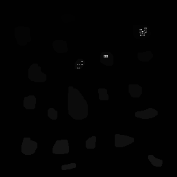

[Home](https://paulovictorcorreia.github.io/)

This page contains the exercises of DIP course lectured by Professor Agostinho Brito Jr, and by that we have an apresentation of the problems and how we solved them, including codes, input images and output images. Student: Paulo Victor Queiroz Correia. Student number: 20170009258.

## 1. Initial Concepts

There were no exercises on this section, but we have to present the makefile for compiling the code and the various modules of the OpenCV library:
```makefile
.SUFFIXES:
.SUFFIXES: .c .cpp

CC = gcc
GCC = g++

.c:
	$(CC) -I$(INCDIR) $(CFLAGS) $< $(GL_LIBS) -o $@

.cpp:
	$(GCC) -Wall -Wunused -std=c++11 -O2 `pkg-config --cflags opencv` $< -o $@ `pkg-config --libs opencv`


```

For compiling a single c++ file, we must execute the following command for a filename.cpp file:
` $ make filename `

## 2. Manipulating pixels on an image

On this section, we're going to see how we can manipulate pixels on OpenCV.

### 2.1 Regions


This exercise asks us to make a program in which asks the user for 2 points on a two dimentional plane, P1 and P2, and then draw a rectangle with the inverted colors of the pixels in the area of the rectangle.

The base image we used is:


For this first exercise, we wrote the following code:
```c++
#include <iostream>
#include <opencv2/opencv.hpp>

using namespace cv;
using namespace std;

int main(int, char**){
  Mat image;
  int P1[2], P2[2];//points in which the user determines the area of the rectangle
  uchar aux;//Auxiliar variable to help inverting the colors
  int minX, minY;//minimum values of parameters X and Y of the rectangle
  int maxX, maxY;//maximum values of parameters X and Y of the rectangle
  int rows, cols;
  //write the image file into a Mat object
  image= imread("biel.png",CV_LOAD_IMAGE_GRAYSCALE);
  if(!image.data){
    cout << "nao abriu biel.png" << endl;
    exit(0);
  }
  rows = image.rows;//number of rows
  cols = image.cols;//number of columns  
  //read area that user wishes to invert the colors
  //and do this only, if only, the given area is
  //valid within the size of the image
  do{
    cout << "P1(x, y): ";
    cin >> P1[0];
    cin >> P1[1];
    cout << "P2(x, y): ";
    cin >> P2[0];
    cin >> P2[1];
  }while((P1[0]>rows) || (P2[0]>rows) || (P1[1]>cols) || (P2[1]>cols));

  //Condition that checks the minimum and maximum
  //values of the cordinate X
  if(P1[0] > P2[0]){
    minX = P2[0];
    maxX = P1[0];
  }
  else{
    minX = P1[0];
    maxX = P2[0];
  }
  //Condition that checks the minimum and maximum
  //values of the cordinate Y
  if(P1[1] > P2[1]){
    minY = P2[1];
    maxY = P1[1];
  }
  else{
    minY = P1[1];
    maxY = P2[1];
  }
  //loop that uses the ranges previously determined to invert
  //the colors of each pixel on grayscale
  for(int i=minX;i<maxX;i++){
    for(int j=minY;j<maxY;j++){
      aux = image.at<uchar>(i,j);
      image.at<uchar>(i,j) = 255 - aux;
    }
  }
  //shows image on a window
  imshow("janela", image);  
  waitKey();

  return 0;
}

```

The entry command on the Linux terminal was this:


And, finally, the output picture of the inverted colors on _biel.png_ picture:


### 2.2 Inverted Quadrants

For this exercise, we had the image as it shows on the scheme:


And then invert the quadrants in such way tha the image ends up like this:


To complete this task, we wrote the following code:

```c++
#include <iostream>
#include <opencv2/opencv.hpp>
#include <string>

using namespace cv;
using namespace std;

int main(int argc, char* argv[]){
    Mat inv_image;
	int rows, cols;//Number of columns and rows
	uchar aux;//Auxiliar variable to change pixels
	string picture;
	if(argc != 2){
		cout << "Input error!\n";
		exit(0);
	}
	picture = argv[1];
	inv_image = imread(argv[1],CV_LOAD_IMAGE_GRAYSCALE);//Read image into Mat object
	if(!inv_image.data){//Checks if picture has a valid format
		cout << "nao abriu imagem" << endl;
		exit(0);
	}
	rows = inv_image.rows;//number of rows
	cols = inv_image.cols;//number of columns

	namedWindow("janela",WINDOW_AUTOSIZE);


	//Loop that inverts the image horizontally
	for(int i=0;i<rows;i++){
		for(int j=0;j<cols/2;j++){
	    	aux = inv_image.at<uchar>(i, j);
	    	inv_image.at<uchar>(i, j) = inv_image.at<uchar>(i, j + cols/2);
	    	inv_image.at<uchar>(i, j + cols/2) = aux;
	    }
	}
	//Loop tha inverts the picture vertically
	for(int i=0;i<rows/2;i++){
		for(int j=0;j<cols;j++){
	    	aux = inv_image.at<uchar>(i, j);
	    	inv_image.at<uchar>(i, j) = inv_image.at<uchar>(i + rows/2, j);
	    	inv_image.at<uchar>(i + rows/2, j) = aux;
	    }
	}
	//The output picture is an inverted version of the original picture
	//in whiche we invert the quadrants of the picture.
	imshow("janela", inv_image);  
	waitKey();


  return 0;
}

```

In which we first change the picture's pixel horizontally, using a nested loop for that, and then we changed vertically, using another nested loop. Also, we had to use
an auxiliar variable 'aux', so we could change the pixels without the need of another Mat object.

The output image we obtained using _biel.png_ was:


## 3. Filling Regions

In this section, we were introduced to labelling techniques using OpenCV function floodFill, in which we used to count the objects in the following image _bolhas.png_:


### 3.1 Enhancing Algorithm
A good question to make is: what if there were more than 255 objects on the scene? To solve this problem, we could use an auxiliar variable, which would accumulate every time the number of objects reach 255, and the variable we used to label would be written down to zero, and the total number of objects on the scene would be the sum of the auxiliar variable and the number in the variable that counts objects at the end of the algorithm.

### 3.2 Counting regions with holes
Now, we were challenged to write a program to count the number of objects with holes in _bolhas.png_. To do this, we had to first remove the objects that were touching the border, because we have no idea of their actual shape. After, we painted the whole background with the color 1 in the greyscale, so we could diferentiate the holes from the background, making our work a lot more easier. After this we count the total amount of images on the scene.

The algorithm will read each pixel and check 3 things:
* If the current pixel is 0 and the previous has the color of the current label, confirming that we have a object with a hole, and then we paint the color of his corresponding label;
* If the current pixel is 0 and the previous has a color smaller the the current label, confirming that we are in another hole from the object, and then we paint the color of his corresponding label, count +1 bubble and  +1 label;
* If we reached the bottom right corner of the image and the label is smaller then the number of objects, so we write _i_ and _j_ down to zero and increases the label.

The code written for this problem is:

```c++
#include <iostream>
#include <opencv2/opencv.hpp>

using namespace cv;
using namespace std;

int main(int argc, char** argv){
  Mat image, mask;
  int width, height;
  int nobjects, nlabel;
  int nbubbles;
  CvPoint p;//OpenCV Class for reading a point and use on floodFill
  image = imread(argv[1],CV_LOAD_IMAGE_GRAYSCALE); //Read iamge in grayscale

  if(!image.data)//Checks if image successfully loaded
  {
    std::cout << "imagem nao carregou corretamente\n";
    return(-1);
  }
  width=image.size().width;
  height=image.size().height;

  //Removes top and bottom objects on the border
  for(int i = 0; i < width; i++)
  {
    p.y = 0;
    p.x = i;
    floodFill(image, p, 0);
    p.y = height-1;
    floodFill(image, p, 0);
  }
  // Removes left and right objects on the border
  for(int i = 0; i < height; i++)
  {
    p.x = 0;
    p.y = i;
    floodFill(image, p, 0);
    p.x = height-1;
    floodFill(image, p, 0);
  }
  //Counts The total number of objects
  nobjects=0;
  for(int i=0; i<height; i++)
  {
    for(int j=0; j<width; j++)
    {
      if(image.at<uchar>(i,j) == 255)
      {
        // achou um objeto
        nobjects++;
        p.x=j;
        p.y=i;
        floodFill(image,p,nobjects);
      }
    }
  }
  //Counts the number of objects with holes in it
  p.x = 0;
  p.y = 0;
  nbubbles = 0;
  nlabel = 1;//Initialiaze label with 1
  floodFill(image, p, 1);

  for(int i=0; i<height; i++)
  {
    for(int j=0; j<width; j++)
    {
      //Checks if the left pixel has the same color of the curent label
      if((image.at<uchar>(i,j-1) == nlabel) && (image.at<uchar>(i,j) == 0))
      {
        // achou um objeto
        nbubbles++;
        p.x=j;
        p.y=i;
        floodFill(image,p,0);
        nlabel++;
      }
      //Checks if the hole is from an object with 2+ holes
      else if((image.at<uchar>(i,j-1) < nlabel) && (image.at<uchar>(i,j) == 0))
      {
        p.x=j;
        p.y=i;
        floodFill(image,p,(int)image.at<uchar>(i,j-1));
      }
      // Make the loop beging again to search for a object with the following label
      if((i == height-1) && (j == width - 1) && (nlabel < nobjects))
      {
        i = 0;
        j = 0;
        nlabel++;

      }
    }
  }
  cout << "Total number of objects: " << nobjects << endl;
  cout << "Total number of objects with bubbles " << nbubbles << endl;
  imshow("image", image);
  imwrite("labeling.png", image);
  waitKey();
  return 0;
}

```

The output image we obtained was:



And the output on terminal:
> Total number of objects: 21


> Total number of objects with bubbles 9

## 4. Histograms
In this section, we are going to use the concepts of histogram for 2 things: calculate the equalization of a image stream and for constructing a primitive motion sensor, using a Playstation Eye, from Sony, for this task, and comparing the histograms of the last two images captured.

### 4.1 Equalization

The first exercize asked us to build an automatic equalizer using a camera and the images' histogram. The equalization was done for the three colors: red, green and blue. But before, what exactly means to equalize a picture?

To equalize a picture means to redistribute the colors stastistically along all the histogram range, adjusting image intensity to enhance contrast. And for doing this, we're going to use the following code:

```c++
#include <iostream>
#include <opencv2/opencv.hpp>

using namespace cv;
using namespace std;

int main(int argc, char** argv){
  Mat image;//Image that we will calculate the histograms and equalize them
  Mat ref;//Reference image for comparison
  int width, height;
  VideoCapture cap;
  vector<Mat> planes;
  Mat histR, histG, histB;
  int nbins = 64;
  float range[] = {0, 256};
  const float \*histrange = { range };
  bool uniform = true;
  bool acummulate = false;

  cap.open(1);

  if(!cap.isOpened()){
    cout << "unavaiable camera\n";
    return -1;
  }

  width  = cap.get(CV_CAP_PROP_FRAME_WIDTH);
  height = cap.get(CV_CAP_PROP_FRAME_HEIGHT);

  cout << "largura = " << width << endl;
  cout << "altura  = " << height << endl;

  int histw = nbins, histh = nbins/2;
  Mat histImgR(histh, histw, CV_8UC3, Scalar(0,0,0));
  Mat histImgG(histh, histw, CV_8UC3, Scalar(0,0,0));
  Mat histImgB(histh, histw, CV_8UC3, Scalar(0,0,0));

  while(1){
    cap >> image;
    ref = image;
    split (image, planes);
    //The next three lines are for we equalize the histograms of image
    equalizeHist(planes[0], planes[0]);
    equalizeHist(planes[1], planes[1]);
    equalizeHist(planes[2], planes[2]);
    merge(planes, image);
    calcHist(&planes[0], 1, 0, Mat(), histR, 1,
             &nbins, &histrange,
             uniform, acummulate);
    calcHist(&planes[1], 1, 0, Mat(), histG, 1,
             &nbins, &histrange,
             uniform, acummulate);
    calcHist(&planes[2], 1, 0, Mat(), histB, 1,
             &nbins, &histrange,
             uniform, acummulate);


    normalize(histR, histR, 0, histImgR.rows, NORM_MINMAX, -1, Mat());
    normalize(histG, histG, 0, histImgG.rows, NORM_MINMAX, -1, Mat());
    normalize(histB, histB, 0, histImgB.rows, NORM_MINMAX, -1, Mat());

    histImgR.setTo(Scalar(0));
    histImgG.setTo(Scalar(0));
    histImgB.setTo(Scalar(0));

    for(int i=0; i<nbins; i++){
      line(histImgR,
           Point(i, histh),
           Point(i, histh-cvRound(histR.at<float>(i))),
           Scalar(0, 0, 255), 1, 8, 0);
      line(histImgG,
           Point(i, histh),
           Point(i, histh-cvRound(histG.at<float>(i))),
           Scalar(0, 255, 0), 1, 8, 0);
      line(histImgB,
           Point(i, histh),
           Point(i, histh-cvRound(histB.at<float>(i))),
           Scalar(255, 0, 0), 1, 8, 0);
    }
    histImgR.copyTo(image(Rect(0, 0       ,nbins, histh)));
    histImgG.copyTo(image(Rect(0, histh   ,nbins, histh)));
    histImgB.copyTo(image(Rect(0, 2*histh ,nbins, histh)));
    imshow("image", image);
    imshow("imageOriginal", ref);
    imwrite("equalized.png", image);
    if(waitKey(30) >= 0) break;
  }
  return 0;
}
```

In this code, named [_equalize.cpp_](equalize.cpp), we first create 3 different histograms with 64 different sets of colors, which means that the first element of the histogram will count pixels from 0 to 3, the second 4 to 7 and so on. After that, we capture an image from the Playstation Eye, split the image in three planes, one for each color, and use OpenCV function _equalizeHist()_ to equalize each one of them. Thus, we calculate the histogram for each plane and normalize them. Then we show the equalized picture side by side with the original picture and compare the results:

Original picture:


Equalized picture:


As we can see, we notice that the equalized picture is brightier than the original, thus we can notice that near the door we can notice quite easier that 2 rectangles of light coming from the street, as if the contrast of the image was enhanced.

## 5. Spacial Filtering

In this section we were first introduced to the use of spacial filters, such as the mean operation, laplacian, gaussian, horizontal and vertical borders and so on.

### 5.1 Laplacian of gaussian

The only exercise of this section was to build a laplacian of gaussian filter, which means apply a laplacian filter over a gaussian bluried image. To do this, we cas use two different kernels and obtain similar results. But, before this, we have to explaing what exactly is going on.

A gaussian distribution is something like this:
\[ f(x) = \frac{1}{\sqrt{2\pi\sigma^2}} e^{\frac{-(x-\mu)}{2\sigma^2}}  \]

And the laplacian is calculated with this operation:

\[ L(x, y) = \nabla^2f(x, y) = \frac{\partial^2f(x,y)}{\partial x^2} + \frac{\partial^2f(x,y)}{\partial y^2} \]

Font: http://academic.mu.edu/phys/matthysd/web226/Lab02.htm, accessed on April 1th 2018.
